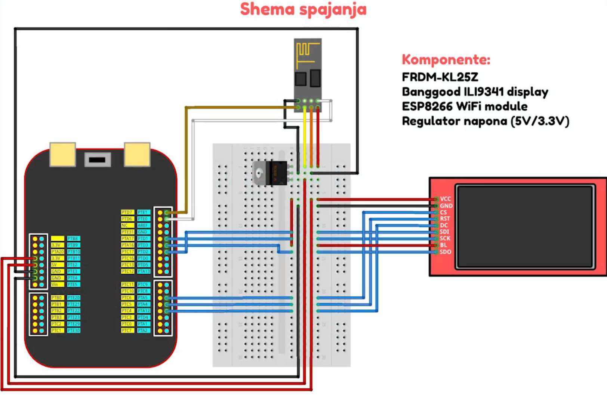
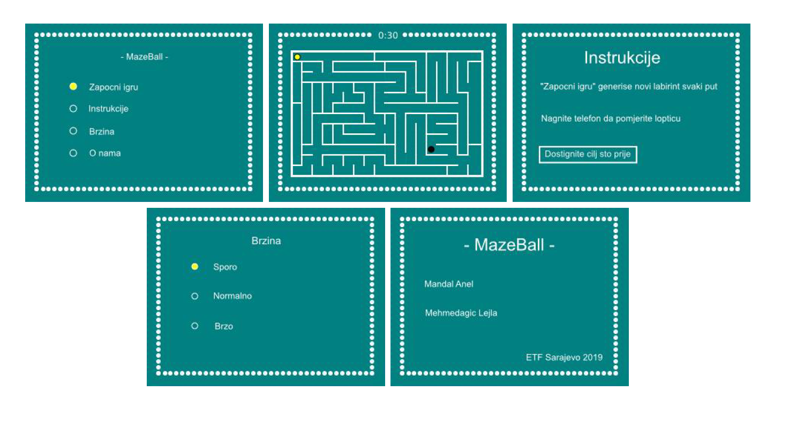
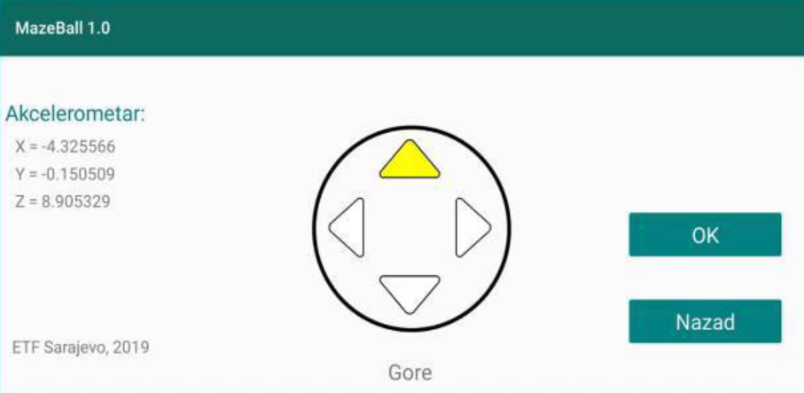

#### Faculty of Electrical Engineering, Sarajevo
#### Embedded systems 2018/2019

---

_MazeBall_ is a maze game which involves controlling a ball by tilting an Android phone so that the ball is manoeuvred towards a goal.
The game was developed on FRDM-KL25Z platform, controlled by an Android app and ESP8266-01 WiFi module.
 
Some relevant features include:
  - Random maze generation (DFS algorithm)
  - Ball speed modification
  - Play timer
  - Intuitive Android app that works as a controller

***
You can find the Android code for the controller at: https://github.com/mand0ne/android-accelerometer-tcp

Demo: https://youtu.be/E4bnFpNkSYM

  

  

  

